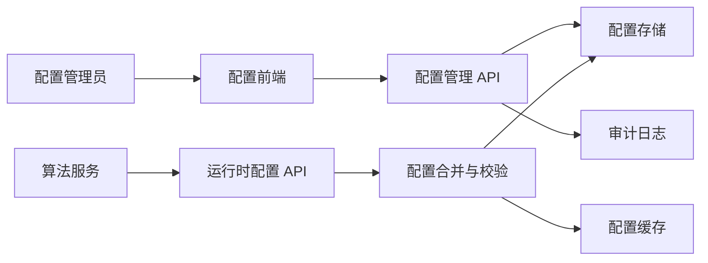
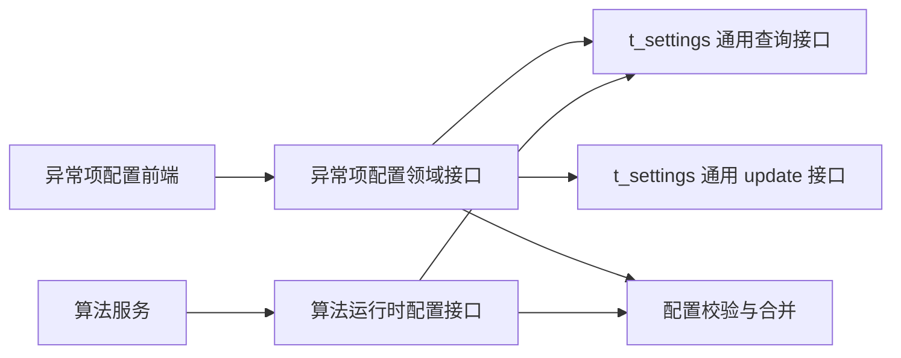

# 异常检验项配置技术设计文档

## 1. 背景

为了支持不同科室对检验异常项提醒规则的差异化管理，系统需要提供一套可配置、可展示、可编辑、可恢复默认，并可被算法稳定消费的异常项配置能力。

算法侧当前给出的配置样例如下：

```json
{
  "department": "肿瘤科",
  "lab_rule_groups": [
    {
      "enabled": true,
      "lab_group_name": "肿瘤标志物",
      "rules": [
        {
          "enabled": true,
          "lab_item_name": "甲胎蛋白",
          "remind_on_negative": false,
          "rule_type": "numeric_range",
          "normal_range": {
            "min": 0.1,
            "max": 0.5,
            "min_inclusive": true,
            "max_inclusive": true
          }
        }
      ]
    },
    {
      "enabled": true,
      "lab_group_name": "*",
      "rules": [
        {
          "enabled": true,
          "lab_item_name": "尿蛋白",
          "remind_on_negative": true,
          "rule_type": "qualitative_value",
          "possible_values": ["-", "+", "++", "+++", "++++"],
          "abnormal_values": ["++", "+++"]
        }
      ]
    }
  ]
}
```

## 2. 目标

1. 支持按照全院默认配置和科室维度保存异常项配置。
2. 支持前端展示、查询、修改对应的异常项配置。
3. 支持科室配置恢复为全院默认配置。
4. 支持算法获取稳定、完整、已合并后的异常项配置。

## 3. 非目标

1. 本期不设计检验项目主数据治理流程，只依赖已有检验项目、检验分组、科室主数据。
2. 本期不设计复杂审批流，配置修改默认即时生效，但保留审计记录。
3. 本期不支持医生或个人级别规则覆盖，仅支持全院和科室两个层级。
4. 本期不处理算法内部如何使用配置判定异常，只定义配置生产、校验、合并和消费契约。

## 4. 核心概念

| 概念         | 说明                                                             |
| ------------ | ---------------------------------------------------------------- |
| 全院默认配置 | `scope_type = hospital` 的基础配置，所有科室默认继承该配置     |
| 科室配置     | `scope_type = department` 的配置，可覆盖全院默认配置           |
| 已解析配置   | 后端将全院默认配置和科室覆盖配置合并后返回给前端或算法的最终配置 |
| 检验分组     | 如“肿瘤标志物”；`*` 表示适用于所有未单独配置的检验分组       |
| 检验项目     | 如“甲胎蛋白”“尿蛋白”                                         |
| 规则类型     | 当前支持数值区间和定性值两类规则                                 |
| 恢复默认     | 删除或停用科室覆盖配置，使科室重新继承全院默认配置               |

## 5. 总体设计

系统按照“配置编辑态”和“算法消费态”分离设计。



主要原则：

1. 存储层复用 `sk_agent_operation.t_settings`，分别保存全院默认配置和科室覆盖配置。
2. 查询展示时后端返回已解析配置，并标记每条规则来源，方便前端展示“继承默认”或“科室覆盖”。
3. 算法只消费已解析配置，不需要感知继承、覆盖、恢复默认等管理逻辑。
4. 所有配置变更记录版本号和审计日志，方便追踪与回滚。

## 6. 配置模型

### 6.1 JSON Schema 语义

顶层字段：

| 字段                | 类型    | 必填     | 说明                                          |
| ------------------- | ------- | -------- | --------------------------------------------- |
| `department`      | string  | 条件必填 | 科室名称；全院默认配置可为空或使用固定值`*` |
| `department_code` | string  | 建议必填 | 科室编码，推荐作为真实关联键                  |
| `lab_rule_groups` | array   | 是       | 检验分组规则列表                              |
| `version`         | integer | 建议必填 | 配置版本号                                    |
| `updated_at`      | string  | 建议必填 | 最后更新时间                                  |

分组字段：

| 字段               | 类型    | 必填     | 说明                             |
| ------------------ | ------- | -------- | -------------------------------- |
| `enabled`        | boolean | 是       | 是否启用该检验分组规则           |
| `lab_group_name` | string  | 是       | 检验分组名称；`*` 表示通配分组 |
| `lab_group_code` | string  | 建议必填 | 检验分组编码                     |
| `rules`          | array   | 是       | 当前分组下的检验项目规则         |

规则字段：

| 字段                   | 类型    | 必填     | 说明                                       |
| ---------------------- | ------- | -------- | ------------------------------------------ |
| `enabled`            | boolean | 是       | 是否启用该检验项目规则                     |
| `lab_item_name`      | string  | 是       | 检验项目名称                               |
| `lab_item_code`      | string  | 建议必填 | 检验项目编码                               |
| `remind_on_negative` | boolean | 是       | 检查结果未命中异常条件时是否仍提醒         |
| `rule_type`          | string  | 是       | `numeric_range` 或 `qualitative_value` |
| `normal_range`       | object  | 条件必填 | 数值区间规则配置                           |
| `possible_values`    | array   | 条件必填 | 定性值所有可选结果                         |
| `abnormal_values`    | array   | 条件必填 | 定性值异常结果集合                         |

数值区间字段：

| 字段              | 类型    | 必填 | 说明                         |
| ----------------- | ------- | ---- | ---------------------------- |
| `min`           | number  | 否   | 正常范围下限；为空表示无下限 |
| `max`           | number  | 否   | 正常范围上限；为空表示无上限 |
| `min_inclusive` | boolean | 是   | 下限是否闭区间               |
| `max_inclusive` | boolean | 是   | 上限是否闭区间               |

### 6.2 推荐扩展后的算法配置

为了降低算法侧歧义，建议在样例基础上补充编码、版本和来源字段：

```json
{
  "department": "肿瘤科",
  "department_code": "ONCOLOGY",
  "version": 12,
  "lab_rule_groups": [
    {
      "enabled": true,
      "lab_group_name": "肿瘤标志物",
      "lab_group_code": "TUMOR_MARKER",
      "source": "department",
      "rules": [
        {
          "enabled": true,
          "lab_item_name": "甲胎蛋白",
          "lab_item_code": "AFP",
          "source": "department",
          "remind_on_negative": false,
          "rule_type": "numeric_range",
          "normal_range": {
            "min": 0.1,
            "max": 0.5,
            "min_inclusive": true,
            "max_inclusive": true
          }
        }
      ]
    }
  ]
}
```

`source` 字段用于前端展示和排查问题。算法如不需要，可忽略。

## 7. 存储设计

### 7.1 使用现有配置表

本期不新增异常项配置专表，直接复用现有通用配置表：

```sql
SELECT * FROM sk_agent_operation.t_settings;
```

根据当前表结构，异常项配置字段映射如下：

| `t_settings` 字段    | 写入方式                      | 说明                                                               |
| ---------------------- | ----------------------------- | ------------------------------------------------------------------ |
| `id`                 | 系统生成                      | 主键                                                               |
| `org_id`             | 当前机构 ID                   | 同一个机构内区分全院默认和科室覆盖配置                             |
| `biz`                | `clinical_decision_support` | 表示临床决策支持相关配置；如需贴合现有枚举，可替换为系统已有业务域 |
| `type`               | `lab_abnormal_rule`         | 表示异常检验项规则配置                                             |
| `setting_key`        | 见 7.2                        | 用于区分全院默认、科室覆盖和历史快照                               |
| `setting_value_type` | `json`                      | 配置值类型固定为 JSON                                              |
| `setting_value`      | JSON 字符串                   | 保存配置元数据和规则内容                                           |
| `ctime`              | 数据库时间                    | 创建时间                                                           |
| `utime`              | 数据库时间                    | 更新时间，可辅助做缓存和冲突判断                                   |

建议增加或确认存在如下唯一约束，避免同一机构同一配置出现多行活跃数据：

```sql
unique key uk_settings_config (org_id, biz, type, setting_key)
```

如果当前生产表暂时不能加唯一约束，则由应用层在写入前按 `org_id + biz + type + setting_key` 先查再更新，禁止插入重复配置行。

### 7.2 setting_key 设计

| 配置类型       | `setting_key` 示例                                 | 说明                                       |
| -------------- | ---------------------------------------------------- | ------------------------------------------ |
| 全院默认配置   | `lab_abnormal_rule:hospital_default`               | 每个`org_id` 一条                        |
| 科室覆盖配置   | `lab_abnormal_rule:department:ONCOLOGY`            | 每个科室最多一条，`ONCOLOGY` 为科室编码  |
| 历史快照，可选 | `lab_abnormal_rule:history:department:ONCOLOGY:12` | 如果没有独立审计日志，可用同表保存历史快照 |
| 历史快照，可选 |  `lab_abnormal_rule:history:hospital_default:8`    | 全院默认配置的历史版本                     |

读取某科室配置时，只需要读取两条配置：

```sql
SELECT setting_key, setting_value, utime
FROM sk_agent_operation.t_settings
WHERE org_id = :org_id
  AND biz = 'clinical_decision_support'
  AND type = 'lab_abnormal_rule'
  AND setting_key IN (
    'lab_abnormal_rule:hospital_default',
    CONCAT('lab_abnormal_rule:department:', :department_code)
  );
```

### 7.3 setting_value 结构

`setting_value` 不建议只存算法样例 JSON，建议增加一层管理元数据，运行时接口再将 `config` 部分转换成算法需要的结构。

全院默认配置：

```json
{
  "schema_version": 1,
  "scope_type": "hospital",
  "scope_code": "*",
  "scope_name": "全院默认",
  "status": "active",
  "version": 8,
  "updated_by": "admin",
  "updated_at": "2026-07-02 10:30:00",
  "config": {
    "department": "*",
    "department_code": "*",
    "lab_rule_groups": []
  }
}
```

科室覆盖配置：

```json
{
  "schema_version": 1,
  "scope_type": "department",
  "scope_code": "ONCOLOGY",
  "scope_name": "肿瘤科",
  "status": "active",
  "version": 12,
  "base_hospital_version": 8,
  "updated_by": "admin",
  "updated_at": "2026-07-02 10:35:00",
  "config": {
    "department": "肿瘤科",
    "department_code": "ONCOLOGY",
    "lab_rule_groups": []
  }
}
```

科室恢复默认后，推荐保留该科室配置行，但将状态置为 `inactive`：

```json
{
  "schema_version": 1,
  "scope_type": "department",
  "scope_code": "ONCOLOGY",
  "scope_name": "肿瘤科",
  "status": "inactive",
  "version": 13,
  "base_hospital_version": 8,
  "updated_by": "admin",
  "updated_at": "2026-07-02 10:40:00",
  "config": null,
  "restore_reason": "恢复全院默认配置"
}
```

这样做的好处是不用物理删除配置行，同时可以从当前行看出该科室曾经恢复过默认。后端解析时只把 `status = active` 的科室配置视为有效覆盖。

### 7.4 写入策略

保存全院默认配置或科室配置时，后端执行 upsert：

1. 按 `org_id + biz + type + setting_key` 查询当前配置。
2. 如果存在，校验请求版本是否等于当前 `version`。
3. 如果版本一致，将 `version + 1` 后更新 `setting_value` 和 `utime`。
4. 如果不存在，插入新行，`version` 从 `1` 开始。
5. 写入成功后清理对应缓存。
6. 如果需要历史追溯，写入前将旧值写入审计日志；没有审计日志时，可写入 `lab_abnormal_rule:history:*` 的同表历史行。

建议不要把每个检验分组或每条检验项目规则拆成独立 `setting_key`。当前规则整体读写更多，保存为单个 JSON 能减少多行事务一致性问题，也更贴合算法消费结构。

### 7.5 复用 t_settings 通用接口

如果系统已经提供 `t_settings` 的通用查询接口和通用 update 接口，本期可以直接复用，不需要为表级 CRUD 再写一套。

推荐分层方式：

1. 通用查询接口负责按 `org_id + biz + type + setting_key` 读取 `setting_value`。
2. 通用 update 接口负责新增或更新 `setting_value`、`setting_value_type` 和 `utime`。
3. 异常项配置领域逻辑负责配置校验、版本冲突判断、全院和科室配置合并、恢复默认、缓存清理和算法响应转换。

也就是说，通用接口解决“配置存取”的问题，异常项配置服务解决“业务语义”的问题。

推荐调用关系：



如果当前阶段不方便新增领域接口，前端也可以直接调用通用查询和 update 接口完成保存，但必须满足以下条件：

1. 前端提交前完成基础结构校验，后端通用 update 侧至少保证 JSON 合法。
2. 通用 update 请求中必须带当前 `version` 或 `utime`，避免并发覆盖。
3. 保存成功后必须触发配置缓存清理，否则算法可能继续使用旧配置。
4. 恢复默认不能删除全院默认配置，只能把科室覆盖配置更新为 `status = inactive`。

算法侧不建议直接消费通用查询接口返回的原始 `setting_value`，因为其中包含管理元数据、继承状态和可能的禁用配置。算法应优先使用运行时接口获取已解析配置。

## 8. 配置继承与合并规则

### 8.1 优先级

配置优先级从高到低：

1. 科室检验项目规则。
2. 科室检验分组配置。
3. 全院检验项目规则。
4. 全院检验分组配置。

### 8.2 合并键

合并时优先使用编码：

1. 分组键：`lab_group_code`；缺失时使用 `lab_group_name`。
2. 项目键：`lab_item_code`；缺失时使用 `lab_item_name`。
3. 通配分组键固定为 `*`。

### 8.3 覆盖策略

1. 科室配置中出现同一分组时，覆盖全院同一分组的 `enabled`。
2. 科室配置中出现同一检验项目规则时，整条规则覆盖全院规则。
3. 科室配置中未出现的分组和规则，继承全院默认配置。
4. `enabled = false` 表示显式关闭，不等同于未配置。
5. `lab_group_name = "*"` 表示通配规则，适用于未命中特定分组规则的检验项目。

### 8.4 恢复默认

恢复默认有两种实现方式：

1. 推荐方案：将科室 `setting_key = lab_abnormal_rule:department:{department_code}` 的配置置为 `inactive`，使科室完全继承全院默认配置。
2. 可选方案：只删除科室中被选中的分组或规则覆盖项，使该分组或规则回退到全院默认。

本期建议先支持“整个科室恢复默认”，前端可在后续扩展“单项恢复默认”。

## 9. 后端接口设计

本章的异常项配置接口可以理解为领域接口，不一定要求绕过现有 `t_settings` 通用接口直接操作数据库。推荐实现方式是：领域接口接收前端请求，完成规则校验和配置合并，然后调用现有 `t_settings` 通用查询或 update 接口完成实际读写。

| 业务动作         | 是否复用通用查询接口 | 是否复用通用 update 接口 | 说明                                                          |
| ---------------- | -------------------- | ------------------------ | ------------------------------------------------------------- |
| 查询已解析配置   | 是                   | 否                       | 查询全院默认配置和科室覆盖配置后，由领域逻辑合并              |
| 查询编辑态配置   | 是                   | 否                       | 查询原始配置后补充`source`、`overridden`、`can_restore` |
| 保存科室配置     | 可选                 | 是                       | 领域逻辑校验通过后调用通用 update 写入科室`setting_key`     |
| 保存全院默认配置 | 可选                 | 是                       | 写入`lab_abnormal_rule:hospital_default`                    |
| 恢复科室默认配置 | 可选                 | 是                       | 将科室`setting_value.status` 更新为 `inactive`            |
| 算法运行时配置   | 是                   | 否                       | 不直接返回原始`setting_value`，需要返回已解析后的算法结构   |

如果产品上希望少做接口，也可以让前端直接使用通用查询和 update 接口维护 `setting_value`。但这种方式需要把校验、版本控制、恢复默认和缓存清理补在通用接口或 BFF 层，否则容易保存出算法无法消费的配置。

### 9.1 查询已解析配置

```http
GET /api/v1/lab-abnormal-rule-configs/resolved?department_code=ONCOLOGY
```

响应：

```json
{
  "code": 0,
  "data": {
    "scope_type": "department",
    "department": "肿瘤科",
    "department_code": "ONCOLOGY",
    "version": 12,
    "inherited_from_hospital_version": 8,
    "lab_rule_groups": []
  }
}
```

用途：

1. 前端配置页展示。
2. 算法服务获取最终可执行配置。

### 9.2 查询编辑态配置

```http
GET /api/v1/lab-abnormal-rule-configs/edit-view?department_code=ONCOLOGY
```

响应中建议额外返回：

| 字段                  | 说明                           |
| --------------------- | ------------------------------ |
| `source`            | `hospital` 或 `department` |
| `overridden`        | 当前节点是否被科室覆盖         |
| `can_restore`       | 当前节点是否可恢复默认         |
| `validation_errors` | 当前配置校验错误               |

该接口主要服务前端编辑页，帮助展示继承状态。

### 9.3 保存科室配置

```http
PUT /api/v1/lab-abnormal-rule-configs/departments/{department_code}
Content-Type: application/json
```

请求：

```json
{
  "version": 12,
  "lab_rule_groups": [
    {
      "enabled": true,
      "lab_group_name": "肿瘤标志物",
      "lab_group_code": "TUMOR_MARKER",
      "rules": []
    }
  ]
}
```

处理逻辑：

1. 校验 `version`，避免覆盖他人刚提交的修改。
2. 校验配置结构和规则合法性。
3. 生成 `setting_key = lab_abnormal_rule:department:{department_code}`。
4. 更新 `sk_agent_operation.t_settings.setting_value`，其中 `status = active`，`version = old_version + 1`。
5. 写入审计日志；如果没有独立审计日志，可额外写入同表历史快照 `lab_abnormal_rule:history:department:{department_code}:{version}`。
6. 清理该科室的配置缓存。
7. 返回新的版本号和已解析配置。

### 9.4 保存全院默认配置

```http
PUT /api/v1/lab-abnormal-rule-configs/hospital-default
Content-Type: application/json
```

处理逻辑与科室配置类似，但写入 `setting_key = lab_abnormal_rule:hospital_default`。全院默认配置修改后，需要清理全院默认缓存和所有科室已解析配置缓存。未做科室覆盖的规则会在下一次查询时自动继承新默认值。

### 9.5 恢复科室默认配置

```http
POST /api/v1/lab-abnormal-rule-configs/departments/{department_code}/restore-default
```

处理逻辑：

1. 查询 `setting_key = lab_abnormal_rule:department:{department_code}` 的科室覆盖配置。
2. 将该行 `setting_value.status` 置为 `inactive`，`config` 置为 `null`，并递增 `version`。
3. 写入审计日志，`operation = restore_default`。
4. 清理该科室配置缓存。
5. 返回全院默认配置解析后的结果。

### 9.6 算法运行时接口

```http
GET /api/v1/runtime/lab-abnormal-rules?department_code=ONCOLOGY
```

响应直接使用算法需要的结构：

```json
{
  "department": "肿瘤科",
  "department_code": "ONCOLOGY",
  "version": 12,
  "lab_rule_groups": []
}
```

运行时接口建议满足：

1. 只返回已启用且合法的规则，或通过参数控制是否返回禁用规则。
2. 响应可缓存，缓存键为 `department_code + resolved_version`。
3. 返回 `ETag` 或 `Last-Modified`，便于算法服务减少重复拉取。

## 10. 配置校验规则

通用校验：

1. `lab_rule_groups` 不允许为空，除非业务允许完全关闭提醒。
2. 同一配置内不允许出现重复分组键。
3. 同一分组内不允许出现重复检验项目键。
4. `enabled`、`remind_on_negative` 必须显式传入布尔值。
5. `rule_type` 必须在支持枚举内。

数值区间规则：

1. `normal_range` 必填。
2. `min` 和 `max` 至少填写一个。
3. 当 `min` 和 `max` 同时存在时，`min <= max`。
4. `min_inclusive` 和 `max_inclusive` 必须显式传入。
5. 数值单位如来自检验主数据，应在前端展示但不写入规则判断值，避免单位换算不一致。

定性值规则：

1. `possible_values` 必填且不能重复。
2. `abnormal_values` 必须是 `possible_values` 的子集。
3. `abnormal_values` 允许为空，表示不因定性值触发异常，但仍可配合 `remind_on_negative` 使用。

通配规则：

1. `lab_group_name = "*"` 的分组最多只能有一个。
2. 通配分组中的规则只在未命中特定分组规则时生效。

## 11. 前端设计

### 11.1 页面结构

配置页建议包含：

1. 科室选择器：支持选择全院默认或具体科室。
2. 配置来源提示：展示当前科室是否存在覆盖配置、继承的全院版本号。
3. 检验分组列表：展示分组启用状态、来源、规则数量。
4. 规则编辑区：展示检验项目、规则类型、正常范围、异常值、是否启用、是否阴性提醒。
5. 操作区：保存、恢复默认、刷新、查看历史版本。

### 11.2 编辑交互

1. 用户选择科室后，前端调用 `edit-view` 接口展示配置。
2. 继承自全院的分组和规则默认只读展示。
3. 用户编辑继承项时，前端将该节点转为科室覆盖项。
4. 保存时提交科室覆盖后的完整编辑态配置。
5. 如果后端返回版本冲突，前端提示用户刷新后重试。
6. 点击恢复默认时弹出确认框，说明会清除当前科室全部覆盖配置。

### 11.3 状态展示

建议使用以下状态标签：

| 状态     | 说明                                 |
| -------- | ------------------------------------ |
| 继承默认 | 当前规则来自全院默认配置             |
| 科室覆盖 | 当前规则已被科室单独配置             |
| 已禁用   | 当前分组或规则不会被算法执行         |
| 校验失败 | 当前规则存在结构或数值错误，不能保存 |

## 12. 算法集成设计

算法侧只依赖运行时接口，不直接访问配置表。

### 12.1 调用时机

可选方案：

1. 启动时拉取全部科室配置，并按版本缓存。
2. 每次任务按科室拉取配置，并使用 `ETag` 做本地缓存。
3. 配置变更后由配置服务发送消息通知算法服务刷新缓存。

推荐先采用“按科室拉取 + 本地缓存 + ETag”，实现简单且能保证配置及时性。

### 12.2 算法消费规则

1. 当分组 `enabled = false` 时，忽略该分组下所有规则。
2. 当规则 `enabled = false` 时，忽略该检验项目规则。
3. `numeric_range` 表示给出正常范围，算法根据检验结果是否落在正常范围外判断异常。
4. `qualitative_value` 表示枚举值判断，算法根据检验结果是否在 `abnormal_values` 中判断异常。
5. 未命中任何具体分组规则时，尝试使用 `lab_group_name = "*"` 的通配规则。
6. `remind_on_negative = true` 时，即使未命中异常条件，也允许算法生成提醒或保留该项目信息。

## 13. 缓存与生效策略

1. 已解析配置缓存键：`lab_abnormal_rule:resolved:{org_id}:{department_code}`。
2. 运行时配置缓存键：`lab_abnormal_rule:runtime:{org_id}:{department_code}:{version}`。
3. 科室配置修改后，只清理该科室缓存。
4. 全院默认配置修改后，清理全院默认缓存和所有科室已解析缓存。
5. 接口响应返回 `version`，算法侧可根据版本判断是否需要刷新。

## 14. 权限与审计

权限建议：

| 权限                                    | 说明             |
| --------------------------------------- | ---------------- |
| `lab_abnormal_rule:view`              | 查看配置         |
| `lab_abnormal_rule:update_department` | 修改科室配置     |
| `lab_abnormal_rule:update_hospital`   | 修改全院默认配置 |
| `lab_abnormal_rule:restore_default`   | 恢复科室默认配置 |
| `lab_abnormal_rule:view_history`      | 查看历史版本     |

审计记录必须包含：

1. 操作人。
2. 操作时间。
3. 操作科室或作用域。
4. 修改前后配置快照。
5. 操作类型。
6. 请求来源 IP 或客户端标识。

## 15. 异常处理

| 场景               | 处理方式                                             |
| ------------------ | ---------------------------------------------------- |
| 科室不存在         | 返回`404`                                          |
| 未配置科室覆盖     | 返回全院默认解析结果                                 |
| 未配置全院默认     | 返回`500` 或初始化空默认配置，推荐上线前强制初始化 |
| 配置结构非法       | 返回`400` 并给出字段级错误                         |
| 版本冲突           | 返回`409`，前端提示刷新                            |
| 算法接口配置不可用 | 返回最近一次可用缓存，并记录告警；无缓存时返回错误   |

## 16. 测试方案

单元测试：

1. 全院默认配置解析。
2. 科室配置覆盖全院同名分组。
3. 科室配置覆盖全院同名检验项目。
4. 科室显式禁用分组或规则。
5. 通配分组匹配逻辑。
6. 数值区间边界值判断。
7. 定性值异常集合校验。

接口测试：

1. 查询全院默认配置。
2. 查询科室已解析配置。
3. 保存科室配置。
4. 保存全院默认配置。
5. 恢复科室默认配置。
6. 版本冲突和非法配置返回。

集成测试：

1. 修改全院默认配置后，未覆盖科室可以继承新默认。
2. 修改全院默认配置后，已覆盖规则不被误覆盖。
3. 恢复默认后，算法接口返回全院默认配置。
4. 算法服务使用缓存时能正确识别版本变化。

## 17. 上线与迁移

1. 初始化全院默认配置。
2. 灰度开放少量科室配置修改权限。
3. 接入算法运行时接口，但保留旧配置来源作为兜底。
4. 校验算法侧结果和配置服务结果一致后，切换为新配置服务。
5. 开启配置变更审计和告警。

回滚方案：

1. 保留旧算法配置读取路径。
2. 配置服务异常时算法继续使用本地最近一次成功配置。
3. 如某次配置修改造成异常，可通过审计日志或 `lab_abnormal_rule:history:*` 历史快照恢复。

## 18. 待确认问题

1. 科室是否以名称还是编码作为算法入参，建议统一使用 `department_code`。
2. 检验分组和检验项目是否已有稳定编码，建议配置中同时保留编码和名称。
3. `remind_on_negative` 的业务语义需要进一步确认：是“阴性结果也提醒”，还是“未异常也提醒”。
4. 是否需要支持单条规则恢复默认，本期建议先不做。
5. `biz` 和 `type` 是否可以新增为 `clinical_decision_support`、`lab_abnormal_rule`；如果必须复用现有枚举，需要和平台配置规范对齐。
6. `t_settings` 是否已有 `org_id + biz + type + setting_key` 唯一约束；如果没有，需要确认是否允许加索引。
7. 是否需要配置审批流，本期建议先通过权限和审计控制风险。
